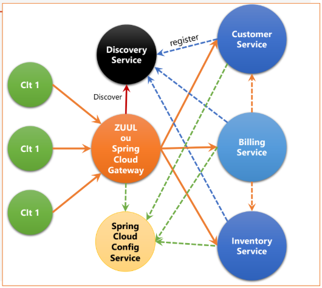
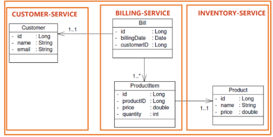

# Projet Microservices : Customer, Inventory et Billing

Ce projet est un **exemple d'architecture microservices** en Java avec Spring Boot, Spring Cloud et Eureka. Il comprend trois services principaux (Customer, Inventory, Billing), un serveur de configuration centralisé et une passerelle (Gateway) pour exposer les API REST. Swagger/OpenAPI est activé pour la documentation de toutes les APIs.

---

## Architecture des Microservices



- **Config Server** : centralise les configurations (`application.properties`, profils dev/prod).
- **Eureka Server** : enregistre tous les services pour la découverte dynamique.
- **Gateway** : point d’entrée unique pour toutes les APIs (port 8888).
- **Services** : chaque service a sa propre base H2 et expose ses endpoints REST.
    - Customer Service : 8081
    - Inventory Service : 8082
    - Billing Service : 8083

---

## Diagramme UML des entités



### Relations principales :

- **Customer** 1 --- * **Bill**
- **Product** 1 --- * **Bill**

---

## Endpoints principaux

| Service           | Endpoint Swagger                         | Exemple API                   |
|------------------|-----------------------------------------|-------------------------------|
| Customer Service  | `http://localhost:8081/swagger-ui/index.html` | `/api/customers`             |
| Inventory Service | `http://localhost:8082/swagger-ui/index.html` | `/api/products`              |
| Billing Service   | `http://localhost:8083/swagger-ui/index.html` | `/api/bills`                 |

Toutes les APIs sont accessibles via la **Gateway** : `http://localhost:8888/{service-name}/api/...`

---

## Pré-requis

- Java 21
- Maven 3.8+
- Spring Boot 3.5+
- H2 Database (in-memory)

---

## Démarrage du projet

1. **Démarrer Config Server** (port 9999)
2. **Démarrer Eureka Server** (port 8761)
3. **Démarrer chaque service** : Customer, Inventory, Billing
4. **Démarrer Gateway** (port 8888)
5. Accéder à Swagger pour tester les endpoints

```bash
mvn spring-boot:run
